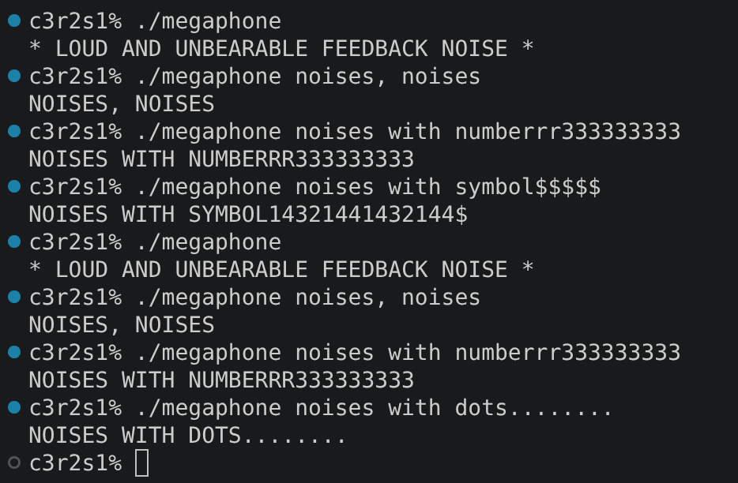
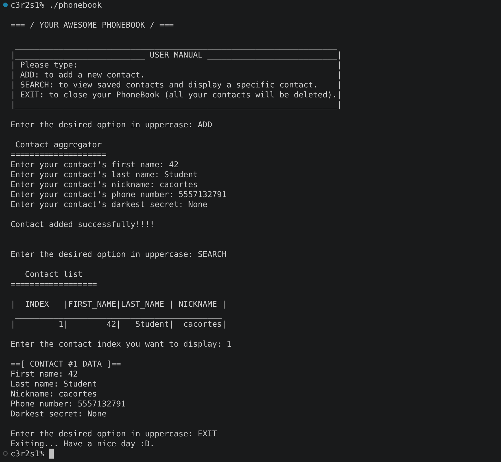

# cpp_module_00

### Clarifications and general tips:
* If you find any kind of error or you have suggestions to improve, please do not hesitate to point them out in the 'issues' section! Obviously always respectfully, thank you :D.
* All the executable files that this project creates have been selected by me. For your own project, you can use whatever names you prefer to create your files, always keeping the subject in mind.
* This module is your first contact with **Object-Oriented Programming** in C++. The goal is not only to make the exercises work, but also to become familiar with the C++ way of thinking.
* **Read the entire subject before starting.** Some requirements are mentioned in the examples instead of the exercise description.
* The entire module must be compiled using:
    * `c++`
    * `-Wall -Wextra -Werror`
    * Your project must also compile correctly with `-std=c++98`.
* Throughout this module remember the following restrictions:
    * Do **not** use `printf()`.
    * Do **not** use `malloc()` or `free()`.
    * Do **not** use `using namespace`.
    * Do **not** implement functions inside header files (unless they are templates, which you won't use yet).
    * The STL containers and algorithms are forbidden until Module 08.
* Watch out for **memory leaks**, even if this module barely uses dynamic memory.
* Learn the difference between:
    * Stack allocation.
    * Heap allocation.
    * Objects.
    * Classes.
    * Member functions.
    * Constructors.
    * Destructors.
* If you are completely new to C++, don't try to compare every feature with C. Many things are done differently on purpose.

### Useful resources:
* LearnCpp:
    * https://www.learncpp.com/
* cplusplus reference:
    * https://cplusplus.com/reference/
* iomanip reference:
    * https://cplusplus.com/reference/iomanip/
* string reference:
    * https://cplusplus.com/reference/string/string/

---

# ex00: Megaphone

### Mandatory requirements:
* Create a program called **megaphone**.
* If one or more arguments are received:
    * Print every argument in **uppercase**.
    * Preserve spaces between arguments.
* If no arguments are received:
    * Print:
```
* LOUD AND UNBEARABLE FEEDBACK NOISE *
```
* Every output must end with a newline.
* Solve the exercise using **C++**, not C.

Example main execution:
```bash
./megaphone "Hello world!"
```

Output:
```text
HELLO WORLD!
```

### What can we learn about this exercise?

Although this exercise looks extremely simple, it introduces several concepts that will be used throughout every C++ module.

You will learn:

* How a C++ program is structured.
* How `std::cout` replaces `printf`.
* How command line arguments are still received through `argc` and `argv`.
* How to use functions from the C++ standard library.
* How to manipulate characters using functions such as `std::toupper()`.

This is also your first contact with compiling a C++ project using the required flags.

### Common mistakes:

* Forgetting to cast the argument to `unsigned char` before using `toupper()`.
* Forgetting the newline at the end.
* Printing multiple spaces accidentally.
* Using `printf()` instead of C++ streams.

### Output example:

#### The example output doesn't have to be exactly like the subject example.



---

# ex01: My Awesome PhoneBook

### Mandatory requirements:

Create two classes:

* **PhoneBook**
* **Contact**

The program must continuously wait for one of the following commands:

* `ADD`
* `SEARCH`
* `EXIT`

### ADD

When the user enters `ADD`:

* Ask the user for:
    * First name.
    * Last name.
    * Nickname.
    * Phone number.
    * Darkest secret.
* Empty fields are **not allowed**.
* Store the contact inside the phonebook.
* The phonebook can only store **8 contacts**.
* When adding a ninth contact, the **oldest** one must be replaced.

### SEARCH

When the user enters `SEARCH`:

* Display every stored contact.
* Show a table containing:
    * Index.
    * First name.
    * Last name.
    * Nickname.
* Every column must:
    * Have a width of **10** characters.
    * Be right aligned.
* If a field is longer than 10 characters:
    * Truncate it.
    * Replace the last visible character with a `.`

Example:

```text
|         0|Guillerm.|Fernande.|guille42|
```

After displaying the table:

* Ask the user for an index.
* If it is valid:
    * Display every field of that contact.
* Otherwise:
    * Show a meaningful error or ignore the input.

The subject expects you to use **iomanip** to format the table.

### EXIT

* Close the program.
* All contacts are lost.

### What can we learn about this exercise?

This exercise is your first real introduction to classes.

You will learn:

* How to split a project into multiple files.
* How classes encapsulate data.
* Public vs private members.
* Objects living inside other objects.
* Arrays of objects.
* Input validation.
* Formatting output using `std::setw()`.
* Basic user interaction through the terminal.

This exercise also encourages writing clean code by separating responsibilities between the `PhoneBook` and `Contact` classes.

### Tips

* Keep all validation inside dedicated functions whenever possible.
* Don't make `main.cpp` huge.
* Consider using helper methods for:
    * Reading input.
    * Printing the table.
    * Validating indices.
* Remember that `std::getline()` is usually better than `operator>>` for interactive programs.

### Common mistakes

* Accepting empty fields.
* Forgetting to replace the oldest contact.
* Misaligning the output table.
* Forgetting to truncate long strings.
* Crashing when the user enters invalid input.
* Mixing `std::cin >>` and `std::getline()` incorrectly.

### Output example

#### The example output doesn't have to be exactly like the subject example.



---
